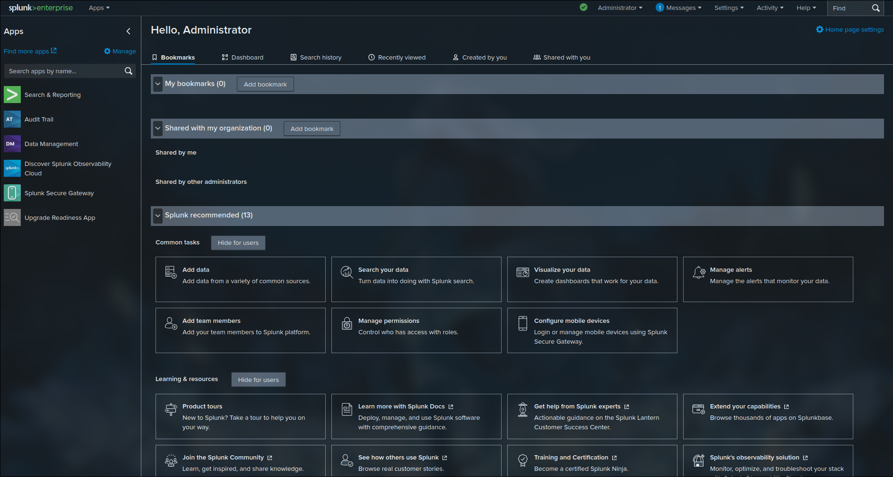

# 🛡️ Lab: Deploying Splunk SIEM


**Date:** 2025-11-20

## 🎯 Objective
> Deploy a local Splunk Enterprise Lab to gain hands on experience with one of the largest SIEM providers.

---

## 💻 Execution Log

### Step 1: Setup

_Commands run:_

Bash

_I started by installing the docker engine._
```bash
sudo pacman -Syu docker
```

_Then I started the docker service._
```bash 
sudo systemctl start docker
```

_Following this I ran the command below. This will run docker in the background utilizing the `-d` flag. The `-p` flag maps the port from my computer to the docker container. Then the command will set the admin password and name the container "splunk"._

_Never use insecure passwords even if you are running something locally. Replace "Welcome123456" with a secure password of your choice._
```bash
sudo docker run -d -p 8000:8000 -e "SPLUNK_GENERAL_TERMS=--accept-sgt-current-at-splunk-com" -e "SPLUNK_START_ARGS=--accept-license" -e "SPLUNK_PASSWORD=Welcome123456" --name splunk splunk/splunk:latest
```

Now that the splunk container is set up we can visit it in our web browser by navigating to http://localhost:8000 and entering our credentials. 
### Step 2: The Analysis (Evidence)

_What did I see?_



> **Observation:** The Splunk Environment has been successfully configured and I am greeted with the dashboard. 

---

## ⚠️ Troubleshooting

| **Issue**                                                                                    | **Root Cause**                                                                                                                                                      | **Fix**                                                                                  |
| -------------------------------------------------------------------------------------------- | ------------------------------------------------------------------------------------------------------------------------------------------------------------------- | ---------------------------------------------------------------------------------------- |
| `Job for docker.service failed` after install                                                | `pacman -Syu` is a full system update. Kernal could not load the new Docker Modules due to the version mismatch.                                                    | Simply reboot the system after an update to load the new kernel.                         |
| Container exited immediately after starting. Logs showed that the licences was not accepted. | The documentation I used was outdated and the standard `--accept-license` flag is no longer enough. they require accepptance of the general rems via a new env var. | Added `-e "SPLUNK_GENERAL_TERMS=--accept-sgt-current-at-splunk-com"` to the run command. |

---

## 🔗 References

* **Official Docker Image:** [Splunk Enterprise on Docker Hub](https://hub.docker.com/r/splunk/splunk)
* **Documentation:** [Splunk Enterprise Container Deployment Guide](https://splunk.github.io/docker-splunk/)