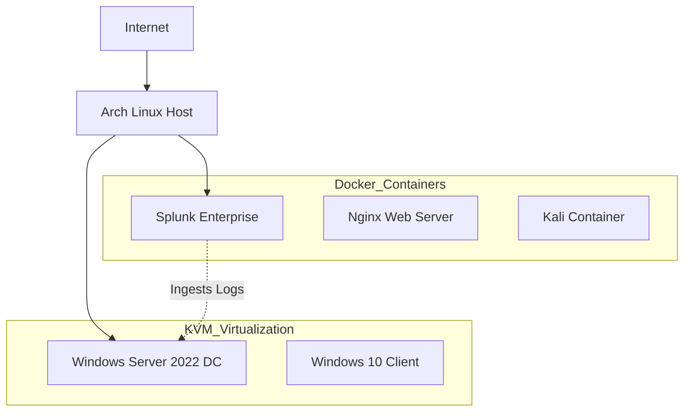

# 🏠 My Home Lab Project

## 🎯 Objective

To simulate an enterprise-grade IT environment on **Arch Linux (KVM/Docker)**, facilitating hands-on learning of **SIEM (Splunk), Network Forensics, and Active Directory**. This project serves as a proof-of-concept for SOC Analyst skills.

## 🗺️ Network Topology

## 🖥️ Environment & Specs

|                     |                       |                     |                   |
| ------------------- | --------------------- | ------------------- | ----------------- |
| **Device**          | **Specs**             | **Role**            | **OS/Hypervisor** |
| **Laptop**          | Arch Linux (16GB RAM) | Hypervisor / Host   | KVM + Docker      |
| **Virtual Network** | `virbr0` (NAT)        | Internal Networking | Linux Bridge      |

## 📂 Project Log (Recent Labs)

_As I complete labs, I will link them here:_

* [Lab 1: Splunk Setup](01_Projects/Lab_01_Splunk_Setup.md) - Setting up Splunk Enterprise in Docker
    
- [[PCAP_Analysis]] - Analyzing SYN Scans with Wireshark
    
- [[AD_Automation]] - Bulk User Creation with PowerShell
    

## 🚀 Roadmap

- [ ] Configure Splunk Universal Forwarder on Windows
    
- [ ] Detect "Brute Force" SSH attacks
    
- [ ] Set up Suricata (IDS)